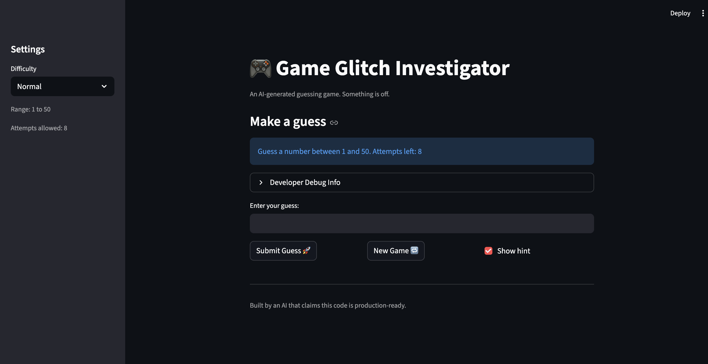

# 🎮 Game Glitch Investigator: The Impossible Guesser

## 🚨 The Situation

You asked an AI to build a simple "Number Guessing Game" using Streamlit.
It wrote the code, ran away, and now the game is unplayable. 

- You can't win.
- The hints lie to you.
- The secret number seems to have commitment issues.

## 🛠️ Setup

1. Install dependencies: `pip install -r requirements.txt`
2. Run the broken app: `python -m streamlit run app.py`

## 🕵️‍♂️ Your Mission

1. **Play the game.** Open the "Developer Debug Info" tab in the app to see the secret number. Try to win.
2. **Find the State Bug.** Why does the secret number change every time you click "Submit"? Ask ChatGPT: *"How do I keep a variable from resetting in Streamlit when I click a button?"*
3. **Fix the Logic.** The hints ("Higher/Lower") are wrong. Fix them.
4. **Refactor & Test.** - Move the logic into `logic_utils.py`.
   - Run `pytest` in your terminal.
   - Keep fixing until all tests pass!

## 📝 Document Your Experience

- [x] Describe the game's purpose.
  - A Streamlit-based number guessing game where the player selects a difficulty (Easy/Normal/Hard), and the app generates a random secret number within a range. The player submits guesses, receives directional hints (higher/lower), and tries to find the number within a limited number of attempts while accumulating a score.
- [x] Detail which bugs you found.
  - The scoring logic for "Too High" guesses was inconsistent: on even-numbered attempts it rewarded +5 points instead of penalizing -5, meaning wrong guesses could increase your score.
  - On even-numbered attempts, the secret number was converted to a string before comparison, causing type mismatches (`int == str` is always `False` in Python 3) that made it impossible to win on those attempts.
  - Invalid guesses (empty input, non-numeric text) still counted as attempts, wasting the player's limited tries.
  - The history list was never cleared when starting a new game, so previous game data carried over.
  - Hard mode only allowed 5 attempts for a 1-100 range, fewer than Easy mode's 6 attempts for 1-20.
- [x] Explain what fixes you applied.
  - Fixed the `update_score` function by removing the attempt-parity check so "Too High" always deducts 5 points, matching the "Too Low" penalty.
  - Refactored all game logic functions (`check_guess`, `parse_guess`, `get_range_for_difficulty`, `update_score`) from `app.py` into `logic_utils.py` to enable unit testing.

## Demo Walkthrough
1. User enters a guess of 40
2. Game returns "Too Low"
3. User enters a guess of 70 → "Too High"
4. Score updates correctly after each guess
5. Game ends after the correct guess



## 🧪 Test Results

```
pytest tests/test_game_logic.py -v

tests/test_game_logic.py::test_winning_guess PASSED
tests/test_game_logic.py::test_guess_too_high PASSED
tests/test_game_logic.py::test_guess_too_low PASSED
tests/test_game_logic.py::test_check_guess_with_string_secret PASSED
tests/test_game_logic.py::test_parse_guess_valid_number PASSED
tests/test_game_logic.py::test_parse_guess_empty_string PASSED
tests/test_game_logic.py::test_parse_guess_none PASSED
tests/test_game_logic.py::test_parse_guess_not_a_number PASSED
tests/test_game_logic.py::test_parse_guess_decimal PASSED
tests/test_game_logic.py::test_easy_range PASSED
tests/test_game_logic.py::test_normal_range PASSED
tests/test_game_logic.py::test_hard_range PASSED
tests/test_game_logic.py::test_win_on_first_attempt PASSED
tests/test_game_logic.py::test_win_score_minimum_is_10 PASSED
tests/test_game_logic.py::test_too_low_decreases_score PASSED
tests/test_game_logic.py::test_too_high_on_odd_attempt_decreases_score PASSED
tests/test_game_logic.py::test_too_high_on_even_attempt_decreases_score PASSED
tests/test_game_logic.py::test_too_high_should_always_penalize PASSED
tests/test_game_logic.py::test_too_high_and_too_low_penalize_equally PASSED
tests/test_game_logic.py::test_check_guess_string_secret_equality PASSED
tests/test_game_logic.py::test_check_guess_string_secret_too_high PASSED
tests/test_game_logic.py::test_check_guess_string_secret_too_low PASSED

========================= 22 passed in 0.01s =========================
```

## 🚀 Stretch Features

- [ ] [If you choose to complete Challenge 4, describe the Enhanced UI changes here — a screenshot is optional]
